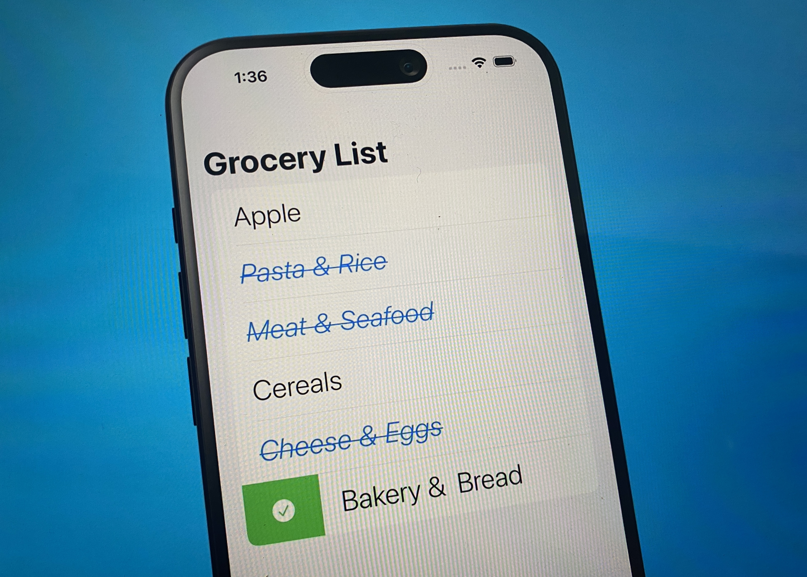
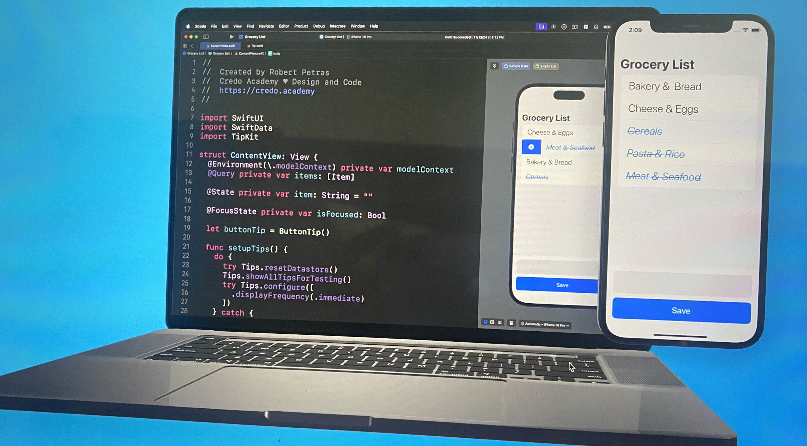
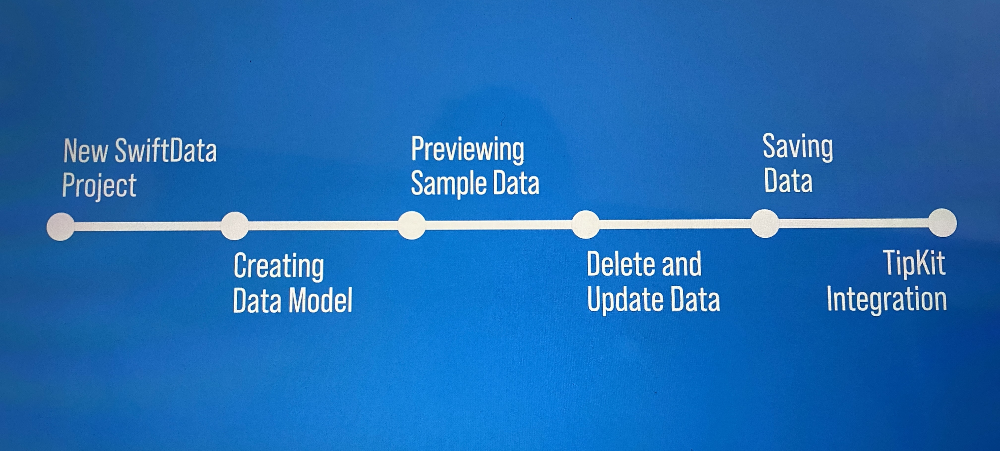

# 🛒 Grocery List App (SwiftUI + SwiftData + TipKit)



[](https://swift.org)
[](https://developer.apple.com/xcode/)
[](https://developer.apple.com/ios/)
[](https://developer.apple.com/xcode/swiftui/)
[](https://developer.apple.com/documentation/swiftdata)
[](https://developer.apple.com/documentation/tipkit)

---

## 📌 Description
Ce projet est une application de **Liste d'épicerie** moderne, développée pour explorer les fonctionnalités avancées de **SwiftData** avec **SwiftUI** et l'intégration de **TipKit** pour améliorer l'expérience utilisateur.  
L'objectif est d'apprendre à **créer, organiser, sauvegarder et gérer des listes d'épicerie** avec des catégories personnalisées, tout en offrant des conseils contextuels grâce à TipKit.

---



## ✨ Fonctionnalités

- ✅ **Gestion des catégories** : Organisation des articles par catégories (Fruits, Légumes, Viandes, etc.)
- ✅ **Ajout/Suppression d'articles** : Interface intuitive pour gérer sa liste de courses
- ✅ **Marquage des articles** : Possibilité de cocher les articles achetés
- ✅ **Persistance des données** : Sauvegarde automatique avec SwiftData
- ✅ **Conseils interactifs** : Intégration de TipKit pour guider l'utilisateur
- ✅ **Interface moderne** : Design épuré avec SwiftUI

---

## 📱 Aperçu de l'application

L'application présente une interface simple et intuitive avec :
- Une liste organisée par catégories d'articles
- Un système de checkbox pour marquer les articles comme achetés
- Des conseils contextuels pour améliorer l'expérience utilisateur
- Une synchronisation automatique entre les différents écrans

---



## 📚 Ce que j'ai appris

En développant cette app, j'ai pu explorer les concepts avancés de l'écosystème Apple :

1. **New SwiftData Project** – Configuration complète d'un projet avec SwiftData
2. **Creating Data Model** – Modèles de données complexes avec relations et catégories
3. **Model Container & Context** – Gestion avancée de la persistance et des requêtes
4. **Previewing Sample Data** – Génération de données de test pour le développement
5. **Saving Data** – Opérations CRUD complètes (Create, Read, Update, Delete)
6. **Delete and Update Data** – Modification et suppression d'articles en temps réel
7. **TipKit Integration** – Mise en place de conseils contextuels pour guider l'utilisateur

---

## 🛠 Technologies utilisées

- **SwiftUI** : Framework d'interface utilisateur déclaratif
- **SwiftData** : Nouveau framework de persistance de données d'Apple
- **TipKit** : Framework pour les conseils et astuces contextuels
- **iOS 17+** : Fonctionnalités modernes du système d'exploitation

---

## 🚀 Installation et Lancement du projet

### 1️⃣ Prérequis
- **Xcode 15+** installé sur votre Mac
- **iOS 17+** pour tester sur simulateur ou appareil physique
- **Swift 5.10+**

### 2️⃣ Cloner le projet
```bash
git clone https://github.com/[votre-username]/GroceryList.git
cd GroceryList
````

### 3️⃣ Ouvrir le projet
```bash
open GroceryList.xcodeproj
```

### 4️⃣ Lancer l'application
- Sélectionnez votre simulateur iOS ou appareil physique
- Appuyez sur ⌘ + R pour compiler et lancer l'app

## License
[MIT License](https://github.com/josue-lubaki/grocery/blob/main/LICENSE)

```
MIT License

Copyright (c) 2025 Josue Lubaki

Permission is hereby granted, free of charge, to any person obtaining a copy
of this software and associated documentation files (the "Software"), to deal
in the Software without restriction, including without limitation the rights
to use, copy, modify, merge, publish, distribute, sublicense, and/or sell
copies of the Software, and to permit persons to whom the Software is
furnished to do so, subject to the following conditions:

The above copyright notice and this permission notice shall be included in all
copies or substantial portions of the Software.

THE SOFTWARE IS PROVIDED "AS IS", WITHOUT WARRANTY OF ANY KIND, EXPRESS OR
IMPLIED, INCLUDING BUT NOT LIMITED TO THE WARRANTIES OF MERCHANTABILITY,
FITNESS FOR A PARTICULAR PURPOSE AND NONINFRINGEMENT. IN NO EVENT SHALL THE
AUTHORS OR COPYRIGHT HOLDERS BE LIABLE FOR ANY CLAIM, DAMAGES OR OTHER
LIABILITY, WHETHER IN AN ACTION OF CONTRACT, TORT OR OTHERWISE, ARISING FROM,
OUT OF OR IN CONNECTION WITH THE SOFTWARE OR THE USE OR OTHER DEALINGS IN THE
SOFTWARE.
```
